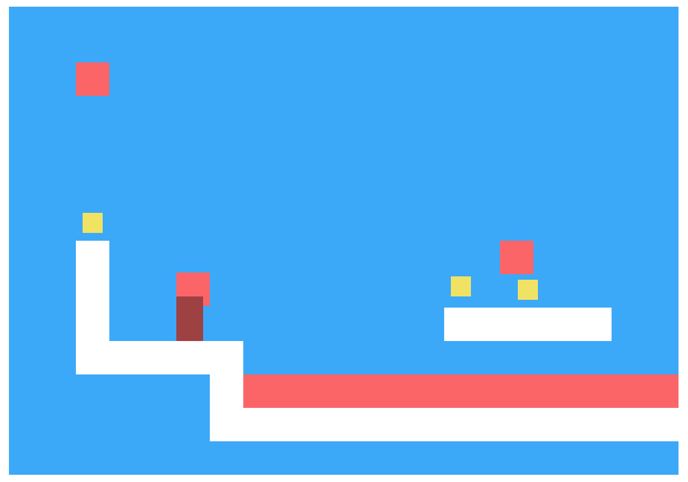

Дипломный проект курса JavaScript
===

В рамках дипломного проекта вам необходимо реализовать ключевые компоненты игры. Игра будет запускаться и работать в браузере.

Игра после реализации имеет следующий интерфейс:


На иллюстрации вы можете видеть:
- Белые стены препятствий.
- Красные огненные шары и лаву.
- Желтые монетки.
- Игрока бордового цвета, потому что в данный момент он умер от столкновения с огненным шаром.

Игрок управляется стрелками с клавиатуры. Основная цель каждого уровня — собрать все монетки.

## Реализация

Реализовать проект и предоставить его на проверку можно двумя способами:
+ Локально и публиковать код в ваш репозиторий [GitHub] или [BitBucket]
+ В онлайн-песочнице [CodePen] или [Repl.it]

Сама игра будет функционировать, когда вы окончательно реализуете все компоненты. Но чтобы понять, правильно ли реализован каждый из них, для каждого компонента дан пример кода и результат его работы, по которому вы можете проверить, правильно ли вы его реализовали. Сам код примеров в итоговом решении оставлять не рекомендуется.

Также есть возможность запустить тесты, которые покажут, верно ли реализован каждый компонент. Об этом будет подробно описано в разделе «Тестирование».

### Реализация в репозитории

#### Подготовка репозитория

1. Установить git.
2. Создайте аккаунт в сервисе [GitHub] или [BitBucket].
3. Создайте публичный репозиторий.
4. Скопируйте ссылку на репозиторий (рекомендуем использовать HTTPS, если ранее вы не сталкивались с SSH).
5. Клонируйте ваш репозиторий локально, используя команду `git clone`.

Итогом будет наличие папки на локальном компьютере, в которой инициализирован git-репозиторий и настроена связь с репозиторием на [GitHub] или [BitBucket].

#### Подготовка проекта

1. Скачайте свежую версию проекта по ссылке

  https://github.com/netology-code/js-game/releases

2. Разверните архив проекта в папку, созданную при подготовке репозитория.
3. Ваш код пишите в файле `./game.js`.
4. Для запуска игры откройте в браузере файл `./index.html`.
5. Для запуска тестов откройте в браузере файл `./test/index.html`.

Менять остальные файлы не рекомендуется.

#### Публикация промежуточных версий

1. Добавьте к коммиту файл `game.js` командой `git add game.js`.
2. Сделайте коммит `git commit`.
3. Опубликуйте изменения с помощью команды `git push`.

#### Создание локального сервера (необязательно)

Все компоненты игры будут работать локально, кроме функции `loadLevels`, действия которой будут заблокированы политикой безопасности бразуера.

Один из вариантов обойти это — запустить локальный веб-сервер.

##### Локальный сервер на php

1. Установить php на компьютер.
2. Для запуска сервера в папке проекта запустить команду `php -S localhost:3000`.
3. Для запуска игры откройте в браузере адрес `http://localhost:3000/index.html`.
4. Для запуска тестов откройте в браузере адрес `http://localhost:3000/test/index.html`.

##### Локальный сервер на NodeJS

1. Установить NodeJS.
2. В папке проекта выполнить команду `npm install`.
3. Для запуска сервера в папке проекта запустить команду `npm start`.
4. Для запуска игры откройте в браузере адрес `http://localhost:3000/index.html`.
5. Для запуска тестов откройте в браузере адрес `http://localhost:3000/test/index.html`.

При использовании NodeJS тесты и игра будут обновляться автоматически при изменении файлов.


### Реализация в песочнице

#### CodePen

Для реализации в онлайн-песочнице вам нужно:

1. Зарегистрироваться на сервисе [CodePen].
2. Открыть заготовку проекта по ссылке:

  https://codepen.io/dfitiskin/pen/XRZqWd?editors=0010

3. Нажать кнопку «Fork», тем самым создав свою копию заготовки.
4. Реализовать код игры, последовательно следуя инструкции, в окне «JS».
5. Периодически сохраняйте результат, чтобы не потерять изменения.
6. Отправляйте наставнику на проверку ссылку на ваш пен.

Инструкция по использованию сервиса CodePen:
https://netology-university.bitbucket.io/wm/resourses/codepen-guide.html

#### Repl.it

1. Зарегистрироваться на сервисе [Repl.it].
2. Создать новую песочницу «HTML, CSS, JS»

  https://repl.it/languages/web_project

3. Во вкладке `index.html` поместите следующий код:

  ```html
  <!DOCTYPE html>
  <html lang="en">
  <head>
    <meta charset="UTF-8">
    <meta name="viewport" content="width=device-width, initial-scale=1.0">
    <meta http-equiv="X-UA-Compatible" content="ie=edge">
    <title>Document</title>
    <link rel="stylesheet" href="https://netology-code.github.io/js-game/css/main.css">
  </head>
  <body>
    <script src="https://netology-code.github.io/js-game/js/app.js"></script>
    <script src="./index.js"></script>
  </body>
  </html>
  ```

4. Нажмите кнопку «Save».
5. Реализовать код игры, последовательно следуя инструкции, во вкладке «index.js».
6. Периодически сохраняйте результат, чтобы не потерять изменения.
7. Отправляйте наставнику на проверку ссылку на вашу песочницу, которую можно получить по кнопке «Share».

## Тестирование

В файле `./test/index.html` настроена среда автоматизированного тестирования вашего кода. Она проверяет созданные компоненты на соответствие требованиям. И если находит расхождения, сообщает об ошибке. Тем самым, тесты — ваш навигатор, показывающий, какую часть требований в вашем коде вы выполнили, а какую нет.

По тестам можно осуществлять навигацию. Можно выбрать конкретный компонент или конкретный метод и следить за выполнением только выбранных тестов, не отвлекаясь на другие.

Также можно отобразить только проваленные тесты или наоборот, только успешные.

Просто кликайте на соответствующий пункт, чтобы сосредоточиться на нем.

Процесс реализации можно построить таким образом:
1. Выбрать компонент или даже метод компонента.
2. Отфильтровать тесты, оставив только выбранный компонент или его метод.
3. Реализовать код, который удовлетворит первому проваленному тесту.
4. Убедиться, что тест помечен как успешный.
5. Если еще остались проваленные тесты, вернуться к пункту 3.

Такой подход называется «разработка через тестирование» или TDD. За тем лишь исключением, что тесты уже написаны.

## Процесс и порядок реализации

Для того, чтобы максимально просто и быстро получить базовый рабочий вариант проекта, рекомендуем придерживаться следующего плана разработки:

1. Реализовать базовые классы игры: `Vector`, `Actor` и `Level`.
2. После этого вы уже сможете запустить игру.
  ```javascript
  const grid = [
    new Array(3),
    ['wall', 'wall', 'lava']
  ];
  const level = new Level(grid);
  runLevel(level, DOMDisplay);
  ```

  На экране отобразится схема уровня. Узнайте подробнее про функцию `runLevel` и класс `DOMDisplay` ниже.

3. Реализуйте `LevelParser`, что позволит вам описывать уровни с помощью текстовой схемы:
  ```javascript
  const schema = [
    '         ',
    '         ',
    '         ',
    '         ',
    '     !xxx',
    '         ',
    'xxx!     ',
    '         '
  ];
  const parser = new LevelParser();
  const level = parser.parse(schema);
  runLevel(level, DOMDisplay);
  ```
4. Реализуйте `Player`, поместите его символ на схему и добавьте словарь при создании парсера:
  ```javascript
  const schema = [
    '         ',
    '         ',
    '         ',
    '         ',
    '     !xxx',
    ' @       ',
    'xxx!     ',
    '         '
  ];
  const actorDict = {
    '@': Player
  }
  const parser = new LevelParser(actorDict);
  const level = parser.parse(schema);
  runLevel(level, DOMDisplay);
  ```
5. Реализуйте другие движущиеся объекты игрового поля и помещайте их символы на схему и в словарь парсера.
6. Реализуйте загрузку уровней с помощью функции `loadLevels` и запуск игры с помощью `runGame`.
7. Когда игрок пройдет все уровни, используйте функцию `alert`, чтобы сообщить о победе.

## Реализованные компоненты, которые необходимо использовать

### Класс `DOMDisplay`

Отвечает за отрисовку в браузере сетки игрового поля и движущихся объектов. Конструктор принимает два аргумента: первый — узел DOM, в котором необходимо отрисовать игровое поле, и уровень `Level`, описывающий игровое поле.

Непосредственно создавать этот объект не потребуется. Его необходимо передавать вторым аргументом в функцию `runLevel` и третьим аргументом в функцию `runGame`.

Пример использования:
```javascript
const schema = [
  '         ',
  '         ',
  '    =    ',
  '         ',
  '     !xxx',
  ' @       ',
  'xxx!     ',
  '         '
];
const actorDict = {
  '@': Player,
  '=': HorizontalFireball
}
const parser = new LevelParser(actorDict);
const level = parser.parse(schema);
DOMDisplay(document.body, level);
```

После такого вызова будет отрисовано исходное состояние сетки игрового поля, все движущиеся объекты. Но эта схема будет статичной.

### Функция `runLevel`

Инициализирует процесс регулярной отрисовки текущего состояния игрового поля и обработку событий клавиатуры.

Принимает два аргумента: уровень (объект класса `Level`) и конструктор объекта, отвечающего за отрисовку. В случае реализации игры в браузере вторым аргументом необходимо использовать класс `DOMDisplay`.

Функция возвращает промис, который разрешится статусом завершения игры, _строка_. С учетом реализации класса `Level` он может принимать значения `won` или `lost`.

Пример использования:
```javascript
const schema = [
  '         ',
  '         ',
  '    =    ',
  '       o ',
  '     !xxx',
  ' @       ',
  'xxx!     ',
  '         '
];
const actorDict = {
  '@': Player,
  '=': HorizontalFireball
}
const parser = new LevelParser(actorDict);
const level = parser.parse(schema);
runLevel(level, DOMDisplay)
  .then(status => console.log(`Игрок ${status}`));
```

После вызова такого кода в браузере будет отрисована схема уровня, движущиеся объекты будут перемещаться, и вы сможете управлять игроком с клавиатуры.

### Функция `runGame`

Инициализирует процесс прохождения игры, состоящей из последовательного прохождения нескольких уровней.

Принимает три аргумента: список схем уровней, _массив_, каждый элемент которого — схема (массив строк); парсер схем, _объект_ `LevelParser`, и конструктор объекта, отвечающего за отрисовку. В случае реализации игры в браузере третьим аргументом необходимо использовать класс `DOMDisplay`.

Возвращает промис, который разрешится, когда пользователь пройдет все уровни.

Пример использования:
```javascript
const schemas = [
  [
    '         ',
    '         ',
    '    =    ',
    '       o ',
    '     !xxx',
    ' @       ',
    'xxx!     ',
    '         '
  ],
  [
    '      v  ',
    '    v    ',
    '  v      ',
    '        o',
    '        x',
    '@   x    ',
    'x        ',
    '         '
  ]
];
const actorDict = {
  '@': Player,
  'v': FireRain
}
const parser = new LevelParser(actorDict);
runGame(schemas, parser, DOMDisplay)
  .then(() => console.log('Вы выиграли приз!'));
```

Запустит игру из двух уровней, которые необходимо будет пройти последовательно.

### Функция `loadLevels`

Загружает коллекцию уровней. Не принимает аргументов.

Возвращает промис, который разрешится JSON-строкой, в которой закодирован массив схем уровней.

## Компоненты, которые необходимо реализовать

### Вектор

Необходимо реализовать класс `Vector`, который позволит контролировать расположение объектов в двумерном пространстве и управлять их размером и перемещением.

#### Конструктор

Принимает два аргумента — координаты по оси X и по оси Y, _числа_, по умолчанию `0`.

Создает объект со свойствами `x` и `y`, равными переданным в конструктор координатам.

#### Метод `plus`

Принимает один аргумент — вектор, _объект_ `Vector`.

Если передать аргумент другого типа, то бросает исключение `Можно прибавлять к вектору только вектор типа Vector`.

Создает и возвращает новый _объект_ типа `Vector`, координаты которого будут суммой соответствующих координат суммируемых векторов.

#### Метод `times`

Принимает один аргумент — множитель, _число_.

Создает и возвращает новый _объект_ типа `Vector`, координаты которого будут равны соответствующим координатам исходного вектора, умноженным на множитель.

#### Пример кода
```javascript
const start = new Vector(30, 50);
const moveTo = new Vector(5, 10);
const finish = start.plus(moveTo.times(2));

console.log(`Исходное расположение: ${start.x}:${start.y}`);
console.log(`Текущее расположение: ${finish.x}:${finish.y}`);
```

Результат выполнения кода:
```
Исходное расположение: 30:50
Текущее расположение: 40:70
```

### Движущийся объект

Необходимо реализовать класс `Actor`, который позволит контролировать все движущиеся объекты на игровом поле и контролировать их пересечение.

#### Конструктор

Принимает три аргумента: расположение, _объект_ типа `Vector`, размер, тоже _объект_ типа `Vector` и скорость, тоже _объект_ типа `Vector`. Все аргументы необязательные. По умолчанию создается объект с координатами 0:0, размером 1x1 и скоростью 0:0.

Если в качестве первого, второго или третьего аргумента передать не объект типа `Vector`, то конструктор должен бросить исключение.

#### Свойства

Должно быть определено свойство `pos`, в котором размещен `Vector`.

Должно быть определено свойство `size`, в котором размещен `Vector`.

Должно быть определено свойство `speed`, в котором размещен `Vector`.

Должен быть определен метод `act`, который ничего не делает.

Должны быть определены свойства только для чтения `left`, `top`, `right`, `bottom`, в которых установлены границы объекта по осям X и Y с учетом его расположения и размера.

Должен иметь свойство `type` — строку со значением `actor`, только для чтения.

#### Метод `isIntersect`

Метод проверяет, пересекается ли текущий объект с переданным объектом, и если да, возвращает `true`, иначе – `false`.

Принимает один аргумент — движущийся объект типа `Actor`. Если передать аргумент другого типа или вызвать без аргументов, то метод бросает исключение.

Если передать в качестве аргумента этот же объект, то всегда возвращает `false`. Объект не пересекается сам с собой.

Объекты, имеющие смежные границы, не пересекаются.

#### Пример кода
```javascript
const items = new Map();
const player = new Actor();
items.set('Игрок', player);
items.set('Первая монета', new Actor(new Vector(10, 10)));
items.set('Вторая монета', new Actor(new Vector(15, 5)));

function position(item) {
  return ['left', 'top', 'right', 'bottom']
    .map(side => `${side}: ${item[side]}`)
    .join(', ');  
}

function movePlayer(x, y) {
  player.pos = player.pos.plus(new Vector(x, y));
}

function status(item, title) {
  console.log(`${title}: ${position(item)}`);
  if (player.isIntersect(item)) {
    console.log(`Игрок подобрал ${title}`);
  }
}

items.forEach(status);
movePlayer(10, 10);
items.forEach(status);
movePlayer(5, -5);
items.forEach(status);
```

Результат работы примера:
```
Игрок: left: 0, top: 0, right: 1, bottom: 1
Первая монета: left: 10, top: 10, right: 11, bottom: 11
Вторая монета: left: 15, top: 5, right: 16, bottom: 6
Игрок: left: 10, top: 10, right: 11, bottom: 11
Первая монета: left: 10, top: 10, right: 11, bottom: 11
Игрок подобрал Первая монета
Вторая монета: left: 15, top: 5, right: 16, bottom: 6
Игрок: left: 15, top: 5, right: 16, bottom: 6
Первая монета: left: 10, top: 10, right: 11, bottom: 11
Вторая монета: left: 15, top: 5, right: 16, bottom: 6
Игрок подобрал Вторая монета
```

### Игровое поле

Объекты класса `Level` реализуют схему игрового поля конкретного уровня, контролируют все движущиеся объекты на нём и реализуют логику игры. Уровень представляет собой координатное поле, имеющее фиксированную ширину и высоту.

Сетка уровня представляет собой координатное двумерное поле, представленное двумерным массивом. Первый массив — строки игрового поля; индекс этого массива соответствует координате Y на игровом поле. Элемент с индексом `5` соответствует строке с координатой Y, равной `5`. Вложенные массивы, расположенные в элементах массива строк, представляют ячейки поля. Индекс этих массивов соответствует координате X. Например, элемент с индексом `10`, соответствует ячейке с координатой X, равной `10`.

Так как `grid` — это двумерный массив, представляющий сетку игрового поля, то, чтобы узнать, что находится в ячейке с координатами X=10 и Y=5 (10:5), необходимо получить значение `grid[5][10]`. Если значение этого элемента равно `undefined`, то эта ячейка пуста. Иначе там будет строка, описывающая препятствие. Например, `wall` — для стены и `lava` — для лавы. Отсюда вытекает следующий факт: все препятствия имеют целочисленные размеры и координаты.

#### Конструктор

Принимает два аргумента: сетку игрового поля с препятствиями, _массив массивов строк_, и список движущихся объектов, _массив объектов_ `Actor`. Оба аргумента необязательные.

#### Свойства

Имеет свойство `grid` — сетку игрового поля. Двумерный массив строк.

Имеет свойство `actors` — список движущихся объектов игрового поля, массив объектов `Actor`.

Имеет свойство `player` — движущийся объект, тип которого — свойство `type` — равно `player`. Игорок передаётся с остальными движущимися объектами.

Имеет свойство `height` — высоту игрового поля, равное числу строк в сетке из первого аргумента.

Имеет свойство `width` — ширину игрового поля, равное числу ячеек в строке сетки из первого аргумента. При этом, если в разных строках разное число ячеек, то `width` будет равно максимальному количеству ячеек в строке.

Имеет свойство `status` — состояние прохождения уровня, равное `null` после создания.

Имеет свойство `finishDelay` — таймаут после окончания игры, равен `1` после создания. Необходим, чтобы после выигрыша или проигрыша игра не завершалась мгновенно.

#### Метод `isFinished`

Определяет, завершен ли уровень. Не принимает аргументов.

Возвращает `true`, если свойство `status` не равно `null` и `finishDelay` меньше нуля.

#### Метод `actorAt`

Определяет, расположен ли какой-то другой движущийся объект в переданной позиции, и если да, вернёт этот объект.

Принимает один аргумент — движущийся объект, `Actor`. Если не передать аргумент или передать не объект `Actor`, метод должен бросить исключение.

Возвращает `undefined`, если переданный движущийся объект не пересекается ни с одним объектом на игровом поле.

Возвращает объект `Actor`, если переданный объект пересекается с ним на игровом поле. Если пересекается с несколькими объектами, вернет первый.

#### Метод `obstacleAt`

Аналогично методу `actorAt` определяет, нет ли препятствия в указанном месте. Также этот метод контролирует выход объекта за границы игрового поля.

Так как движущиеся объекты не могут двигаться сквозь стены, то метод принимает два аргумента: положение, куда собираемся передвинуть объект, _вектор_ `Vector`, и размер этого объекта, тоже _вектор_ `Vector`. Если первым и вторым аргументом передать не `Vector`, то метод бросает исключение.

Вернет строку, соответствующую препятствию из сетки игрового поля, пересекающему область, описанную двумя переданными векторами, либо `undefined`, если в этой области препятствий нет.

Если описанная двумя векторами область выходит за пределы игрового поля, то метод вернет строку `lava`, если область выступает снизу. И вернет `wall` в остальных случаях. Будем считать, что игровое поле слева, сверху и справа огорожено стеной и снизу у него смертельная лава.

#### Метод `removeActor`

Метод удаляет переданный объект с игрового поля. Если такого объекта на игровом поле нет, не делает ничего.

Принимает один аргумент, объект `Actor`. Находит и удаляет его.

#### Метод `noMoreActors`

Определяет, остались ли еще объекты переданного типа на игровом поле.

Принимает один аргумент — тип движущегося объекта, _строка_.

Возвращает `true`, если на игровом поле нет объектов этого типа (свойство `type`). Иначе возвращает `false`.

#### Метод `playerTouched`

Один из ключевых методов, определяющий логику игры. Меняет состояние игрового поля при касании игроком каких-либо объектов или препятствий.

Если состояние игры уже отлично от `null`, то не делаем ничего, игра уже и так завершилась.

Принимает два аргумента. Тип препятствия или объекта, _строка_. Движущийся объект, которого коснулся игрок, — объект типа `Actor`, необязательный аргумент.

Если первым аргументом передать строку `lava` или `fireball`, то меняем статус игры на `lost` (свойство `status`). Игрок проигрывает при касании лавы или шаровой молнии.

Если первым аргументом передать строку `coin`, а вторым — объект монеты, то необходимо удалить эту монету с игрового поля. Если при этом на игровом поле не осталось больше монет, то меняем статус игры на `won`. Игрок побеждает, когда собирает все монеты на уровне. Отсюда вытекает факт, что уровень без монет пройти невозможно.

#### Пример кода

```javascript
const grid = [
  [undefined, undefined],
  ['wall', 'wall']
];

function MyCoin(title) {
  this.type = 'coin';
  this.title = title;
}
MyCoin.prototype = Object.create(Actor);
MyCoin.constructor = MyCoin;

const goldCoin = new MyCoin('Золото');
const bronzeCoin = new MyCoin('Бронза');
const player = new Actor();
const fireball = new Actor();

const level = new Level(grid, [ goldCoin, bronzeCoin, player, fireball ]);

level.playerTouched('coin', goldCoin);
level.playerTouched('coin', bronzeCoin);

if (level.noMoreActors('coin')) {
  console.log('Все монеты собраны');
  console.log(`Статус игры: ${level.status}`);
}

const obstacle = level.obstacleAt(new Vector(1, 1), player.size);
if (obstacle) {
  console.log(`На пути препятствие: ${obstacle}`);
}

const otherActor = level.actorAt(player);
if (otherActor === fireball) {
  console.log('Пользователь столкнулся с шаровой молнией');
}
```

Результат выполнения:
```
Все монеты собраны
Статус игры: won
На пути препятствие: wall
Пользователь столкнулся с шаровой молнией
```

### Парсер уровня

Объект класса `LevelParser` позволяет создать игровое поле `Level` из массива строк по следующему принципу:
* Каждый элемент массива соответствует строке в сетке уровня.
* Каждый символ строки соответствует ячейке в сетке уровня.
* Символ определяет тип объекта или препятствия.
* Индекс строки и индекс символа определяют исходные координаты объекта или координаты препятствия.

Символы и соответствующие им препятствия и объекты игрового поля:
* **x** — стена, препятствие
* **!** — лава, препятствие
* **@** — игрок, объект
* **o** — монетка, объект
* **=** — движущаяся горизонтально шаровая молния, объект
* **|** — движущаяся вертикально шаровая молния, объект
* **v** — огненный дождь, объект

> Обратите внимание, что тут слово «символ» означает букву, цифру или знак, которые используются в строках, а не тип данных `Symbol`.

#### Конструктор

Принимает один аргумент — словарь движущихся объектов игрового поля, _объект_, ключами которого являются символы из текстового представления уровня, а значениями — конструкторы, с помощью которых можно создать новый объект.

#### Метод `actorFromSymbol`

Принимает символ, _строка_. Возвращает конструктор объекта по его символу, используя словарь. Если в словаре не нашлось ключа с таким символом, вернет `undefined`.

#### Метод `obstacleFromSymbol`

Аналогично принимает символ, _строка_. Возвращает строку, соответствующую символу препятствия. Если символу нет соответствующего препятствия, то вернет `undefined`.

Вернет `wall`, если передать `x`.

Вернет `lava`, если передать `!`.

Вернет `undefined`, если передать любой другой символ.

#### Метод `createGrid`

Принимает массив строк и преобразует его в массив массивов, в ячейках которого хранится либо строка, соответствующая препятствию, либо `undefined`.

Движущиеся объекты не должны присутствовать на сетке.

#### Метод `createActors`

Принимает массив строк и преобразует его в массив движущихся объектов, используя для их создания конструкторы из словаря.

Количество движущихся объектов в результирующем массиве должно быть равно количеству символов объектов в массиве строк.

Каждый объект должен быть создан с использованием вектора, определяющего его положение с учетом координат, полученных на основе индекса строки в массиве (Y) и индекса символа в строке (X).

Для создания объекта должен быть использован конструктор из словаря, соответствующий символу. При этом, если этот конструктор не является экземпляром `Actor`, то такой символ игнорируется, и объект не создается.

#### Метод `parse`

Принимает массив строк, создает и возвращает игровое поле, заполненное препятствиями и движущимися объектами, полученными на основе символов и словаря.

#### Пример использования

```javascript
const plan = [
  ' @ ',
  'x!x'
];

const actorsDict = Object.create(null);
actorsDict['@'] = Actor;

const parser = new LevelParser(actorsDict);
const level = parser.parse(plan);

level.grid.forEach((line, y) => {
  line.forEach((cell, x) => console.log(`(${x}:${y}) ${cell}`));
});

level.actors.forEach(actor => console.log(`(${actor.pos.x}:${actor.pos.y}) ${actor.type}`));
```

Результат выполнения кода:
```
(0:0) undefined
(1:0) undefined
(2:0) undefined
(0:1) wall
(1:1) lava
(2:1) wall
(1:0) actor
```

### Шаровая молния

Класс `Fireball` станет прототипом для движущихся опасностей на игровом поле. Он должен наследовать весь функционал движущегося объекта `Actor`.

#### Конструктор

Принимает два аргумента: координаты, _объект_ `Vector` и скорость, тоже _объект_ `Vector`. Оба аргумента необязательные. По умолчанию создается объект с координатами `0:0` и скоростью `0:0`.

#### Свойства

Созданный объект должен иметь свойство `type` со значением `fireball`. Это свойство только для чтения.

Также должен иметь размер `1:1` в свойстве `size`, _объект_ `Vector`.

#### Метод `getNextPosition`

Создает и возвращает вектор `Vector` следующей позиции шаровой молнии. Это функция времени. И как в школьной задаче, новая позиция — это текущая позиция плюс скорость, умноженная на время. И так по каждой из осей.

Принимает один аргумент, время, _число_. Аргумент необязательный, по умолчанию равен `1`.

#### Метод `handleObstacle`

Обрабатывает столкновение молнии с препятствием. Не принимает аргументов. Ничего не возвращает.

Меняет вектор скорости на противоположный. Если он был `5:5`, то после должен стать `-5:-5`.

#### Метод `act`

Обновляет состояние движущегося объекта.

Принимает два аргумента. Первый — время, _число_, второй — игровое поле, _объект_ `Level`.

Метод ничего не возвращает. Но должен выполнить следующие действия:
1. Получить следующую позицию, используя время.
2. Выяснить, не пересечется ли в следующей позиции объект с каким-либо препятствием. Пересечения с другими движущимися объектами учитывать не нужно.
3. Если нет, обновить текущую позицию объекта.
4. Если объект пересекается с препятствием, то необходимо обработать это событие. При этом текущее положение остается прежним.

#### Пример использования

```javascript
const time = 5;
const speed = new Vector(1, 0);
const position = new Vector(5, 5);

const ball = new Fireball(position, speed);

const nextPosition = ball.getNextPosition(time);
console.log(`Новая позиция: ${nextPosition.x}: ${nextPosition.y}`);

ball.handleObstacle();
console.log(`Текущая скорость: ${ball.speed.x}: ${ball.speed.y}`);
```

Результат работы кода:
```
Новая позиция: 10: 5
Текущая скорость: -1: 0
```

### Горизонтальная шаровая молния

Вам необходимо самостоятельно реализовать класс `HorizontalFireball`. Он будет представлять собой объект, который движется по горизонтали со скоростью `2` и при столкновении с препятствием движется в обратную сторону.

Конструктор должен принимать один аргумент — координаты текущего положения, _объект_ `Vector`. И создавать объект размером `1:1` и скоростью, равной `2` по оси X.

### Вертикальная шаровая молния

Вам необходимо самостоятельно реализовать класс `VerticalFireball`. Он будет представлять собой объект, который движется по вертикали со скоростью `2` и при столкновении с препятствием движется в обратную сторону.

Конструктор должен принимать один аргумент: координаты текущего положения, _объект_ `Vector`. И создавать объект размером `1:1` и скоростью, равной `2` по оси Y.

### Огненный дождь

Вам необходимо самостоятельно реализовать класс `FireRain`. Он будет представлять собой объект, который движется по вертикали со скоростью `3` и при столкновении с препятствием начинает движение в том же направлении из исходного положения, которое задано при создании.

Конструктор должен принимать один аргумент — координаты текущего положения, _объект_ `Vector`. И создавать объект размером `1:1` и скоростью, равной `3` по оси Y.

### Монета

Класс `Coin` реализует поведение монетки на игровом поле. Чтобы привлекать к себе внимание, монетки должны постоянно подпрыгивать в рамках своей ячейки. Класс должен наследовать весь функционал движущегося объекта `Actor`.

#### Конструктор

Принимает один аргумент — координаты положения на игровом поле, _объект_ `Vector`.

Созданный объект должен иметь размер `0,6:0,6`. А его реальные координаты должны отличаться от тех, что переданы в конструктор, на вектор `0,2:0,1`.

#### Свойства

Свойство `type` созданного объекта должно иметь значение `coin`.

Также объект должен иметь следующие свойства:
* Скорость подпрыгивания, `springSpeed`, равная `8`;
* Радиус подпрыгивания, `springDist`, равен `0.07`;
* Фаза подпрыгивания, `spring`, случайное число от `0` до `2π`.

#### Метод `updateSpring`

Обновляет фазу подпрыгивания. Это функция времени.

Принимает один аргумент — время, _число_, по умолчанию `1`.

Ничего не возвращает. Обновляет текущую фазу `spring`, увеличив её на скорость `springSpeed`, умноженную на время.

#### Метод `getSpringVector`

Создает и возвращает вектор подпрыгивания. Не принимает аргументов.

Так как подпрыгивание происходит только по оси Y, то координата X вектора всегда равна нулю.

Координата Y вектора равна синусу текущей фазы, умноженному на радиус.

#### Метод `getNextPosition`

Обновляет текущую фазу, создает и возвращает вектор новой позиции монетки.

Принимает один аргумент — время, _число_, по умолчанию `1`.

Новый вектор равен базовому вектору положения, увеличенному на вектор подпрыгивания. Увеличивать нужно именно базовый вектор положения, который получен в конструкторе, а не текущий.

#### Метод `act`

Принимает один аргумент — время. Получает новую позицию объекта и задает её как текущую. Ничего не возвращает.

### Игрок

Класс `Player` содержит базовый функционал движущегося объекта, который представляет игрока на игровом поле. Должен наследовать возможности `Actor`.

#### Конструктор

Принимает один аргумент — координаты положения на игровом поле, _объект_ `Vector`.

Созданный объект, реальное положение которого отличается от того, что передано в конструктор, на вектор `0:-0,5`. Имеет размер `0,8:1,5`. И скорость `0:0`.

#### Свойства

Имеет свойство `type`, равное `player`.

[bitbucket]: https://bitbucket.org/
[github]: https://github.com/
[codepen]: https://codepen.io/
[Repl.it]: https://repl.it/
